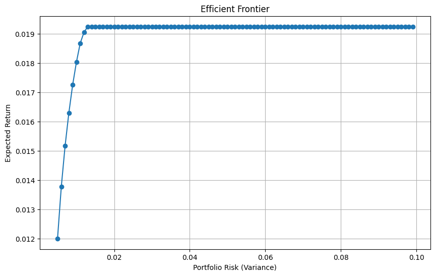
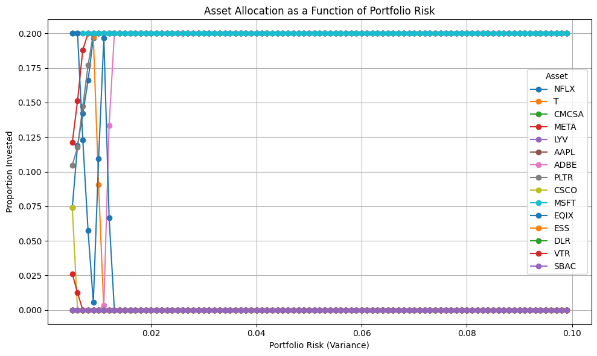

# 📊 Stock Portfolio Optimization Project

## 🚀 What this project is

I built this project to understand how we can take real stock market data and turn it into a structured investment strategy.

Instead of picking individual stocks, I wanted to answer:

👉 *How do we combine multiple stocks in a way that balances risk and return, while still staying diversified?*

This project takes that idea end-to-end — from raw data to an optimized portfolio.

---

## 🧠 What I actually did

### 1. Pulled real market data

I collected stock data (2022–2024) across:

* Tech (AAPL, MSFT, META, NFLX, ADBE, PLTR)
* Telecom (T, CMCSA)
* Real Estate (DLR, VTR, ESS, SBAC, EQIX)

Then converted it into:

* Daily returns
* Monthly returns (used for modeling)

---

### 2. Understood how these stocks behave

Before building anything, I explored:

* Which stocks move together?
* Which ones behave differently?

What stood out:

* Tech stocks tend to move together → higher risk as a group
* Real estate and telecom stocks behave more independently
* This creates real diversification opportunities

👉 This step was important because diversification only works if assets don’t all move the same way.

---

### 3. Built a portfolio model

I created a model that:

* Allocates weights across all stocks
* Ensures total allocation = 100%
* Limits each stock to max 20%

👉 This prevents over-concentration and forces diversification.

The model then explores multiple risk levels and finds the best allocation for each.

---

## 📊 What the plots show

### Efficient Frontier (Risk vs Return)



This plot shows the relationship between:

* Risk (how volatile the portfolio is)
* Return (expected gain)

What I observed:

* At first, increasing risk improves return
* After a point, the curve flattens → taking more risk doesn’t give much extra return

👉 This helped me understand where “too much risk” stops being worth it.

---

### Asset Allocation Across Risk Levels



Each line represents how much weight is given to a stock as risk increases.

What this shows:

* Some stocks dominate the portfolio across many risk levels
* Others are almost never selected
* The model keeps adjusting weights as it moves from conservative → aggressive portfolios

---

## 🔍 Key insights (this is what really mattered)

### 📌 Not all stocks are equally useful

* A few stocks consistently get high allocation
* Many stocks get near-zero weight

👉 This means:

> Just adding more stocks doesn’t improve a portfolio — only the *right* ones matter.

---

### 📌 MSFT stands out strongly

* Microsoft stays at **~20% allocation across almost all portfolios**
* The model *always wants more*, but is capped at 20%

👉 This tells me:

> MSFT has a strong combination of return + stability + diversification value

---

### 📌 Other dominant stocks

Stocks like:

* EQIX
* PLTR
* META
* ADBE
* T

also frequently hit the **20% cap**

👉 Meaning:

> These are the most “valuable” assets in the portfolio according to the model

---

### 📌 The 20% cap actually matters

Without the constraint:

* The model would heavily concentrate on a few stocks

With the constraint:

* The portfolio is forced to spread across sectors

👉 This makes the solution more realistic (like real-world funds)

---

### 📌 More risk ≠ much more return (after a point)

From the efficient frontier:

* There’s a clear point where returns stop increasing meaningfully
* But risk continues increasing

👉 That’s where a “balanced” portfolio makes more sense

---

## 💡 Final output

The model generates three practical portfolio types:

* **Conservative** → lower risk
* **Balanced** → best return for risk
* **Aggressive** → highest return

Saved here:

```bash
portfolio-pipeline/output_dir/key_portfolios.csv
```

---

## 🛠️ Tools I used

* Python
* Pandas, NumPy
* Matplotlib
* Pyomo (for optimization)
* yFinance (for stock data)

---

## ▶️ How to run

```bash
git clone https://github.com/nihasharma21/BDM-Project.git
cd BDM-Project/portfolio-pipeline
pip install -r requirements.txt
python main.py
```

---

## 📓 Colab version

I’ve also included a Colab notebook in this repo that:

* Clones the project
* Installs dependencies
* Runs the pipeline end-to-end

Useful if you want to run it quickly without setup.

---

## 📁 Project structure

```bash
BDM-Project/
│
├── docs/
│   └── images/
│       ├── efficient_frontier.png
│       └── allocations_spaghetti.png
│
├── portfolio-pipeline/
│   ├── main.py
│   ├── src/
│   └── output_dir/
│
└── ReadMe.md
```

---

## 🎯 What I take away from this

This project helped me understand:

* How risk actually shows up in data
* Why correlation matters more than individual performance
* How constraints shape real-world decisions
* How to move from raw data → decision-making

---
